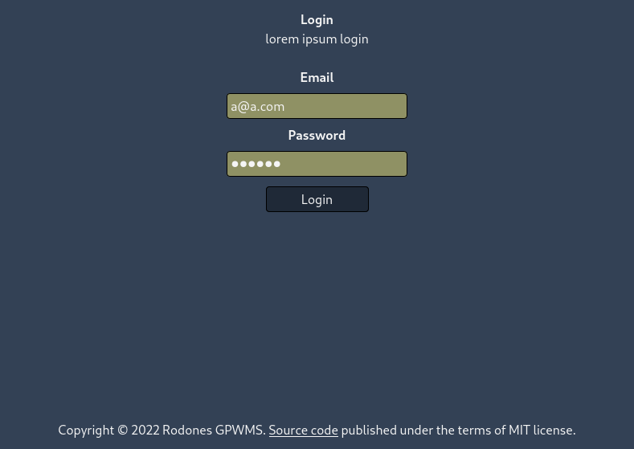
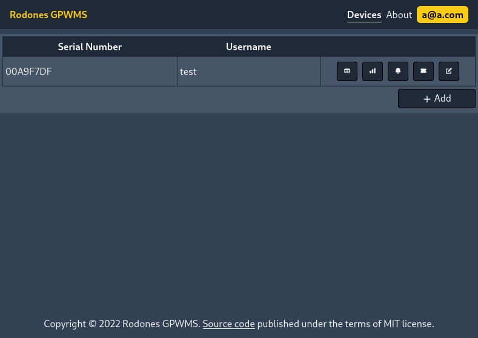
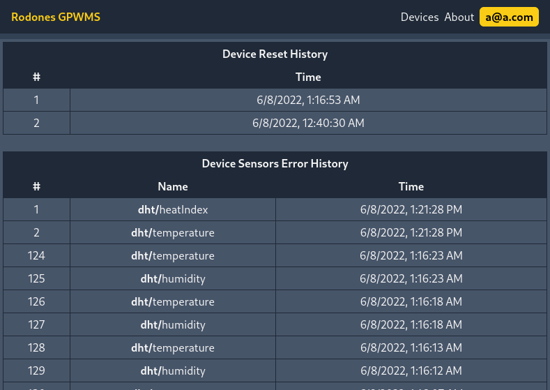
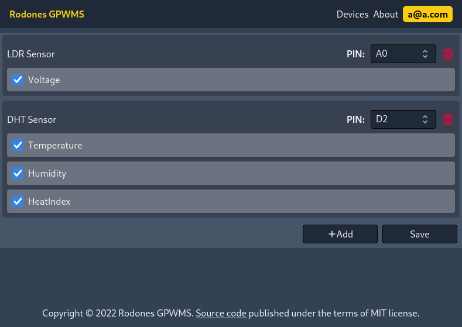
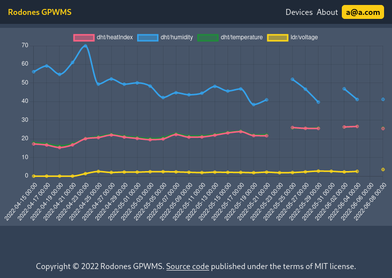
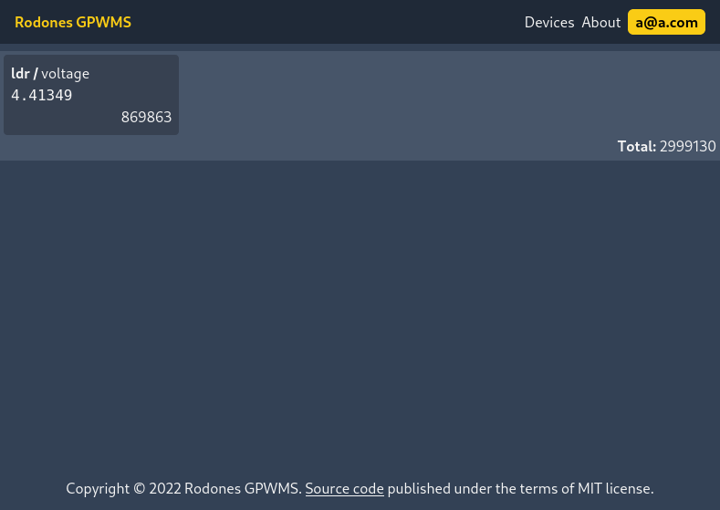

# iztech-ceng424-embedded-computer-systems
IZTECH CENG 424 - Embedded Computer Systems 

<table>
  <tbody>
    <tr>
      <td style="text-align: center;"><b>Login page</b></td>
      <td style="text-align: center;"><b>Devices page</b></td>
      <td style="text-align: center;"><b>Device logs page</b></td>
    </tr>
    <tr>
      <td style="text-align: center;"><b>Device sensors page</b></td>
      <td style="text-align: center;"><b>Device sensor data graph page</b></td>
      <td style="text-align: center;"><b>Device live sensor values page</b></td>
    </tr>
  </tbody>
</table>